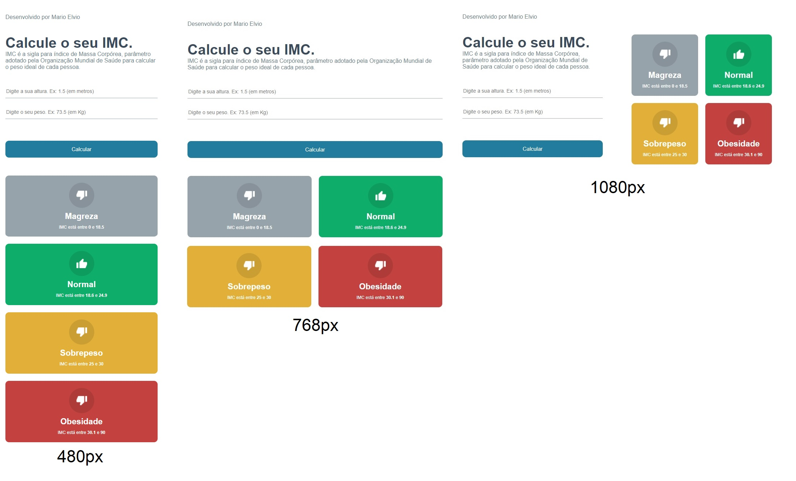

# Calculadora de IMC

## Projeto feito em React, TypeScript e CSS Modules.

### Visualizar Projeto:
🔗 <a href="https://www.marioelvio.com/portfolio/10">www.marioelvio.com/portfolio/10</a>
### Instalação do Projeto:
- `npm install`
### Execução do Projeto:
- `npm start`

### Projeto desenvolviodo durante o curso de React da B7Web.